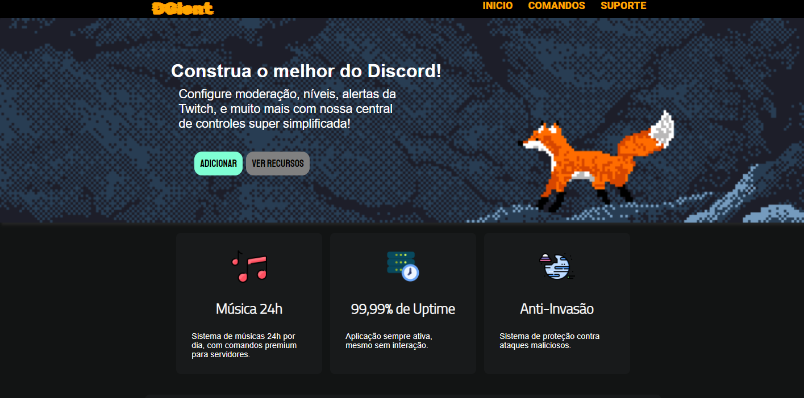
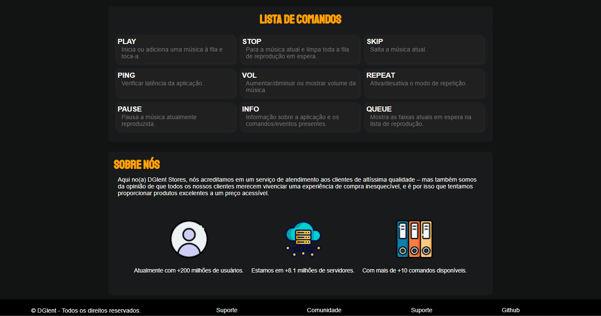

    <h1 align="center">DGlent Músic</h1>
    
Site criado com intuido de aprendizagem, voltado a aplicações plataforma do discord

    

    	
    
    

 
    <h2>Descrição do projeto:</h2>
    
Projeto criado para desenvolvimento e interação com HTML5 e CSS3. Esse projeto foi criado para auxiliar com a criação de um website para aplicações feitas para bots na plataforma discord.

Página principal:

    
    

    <h2>Ficha Técnica:</h2>
    <h3>Front end</h3>
    <ul>
        <li>HTML5</li>
        <li>CSS3</li>
    </ul>
    <h2>Como executar o projeto:</h2>
    
Realize o download ou fork do repositório

    
 git clone https://github.com/1ELShiroe/website-template

    
Execute o arquivo index.html com qualquer editor de código e realize as alterações necessárias.

<h2>Autor do projeto:</h2>
 </ELShiroe.this>

<a href="https://github.com/1ELShiroe" target="_blank" rel="noopener noreferrer">1ELShiroe</a>

